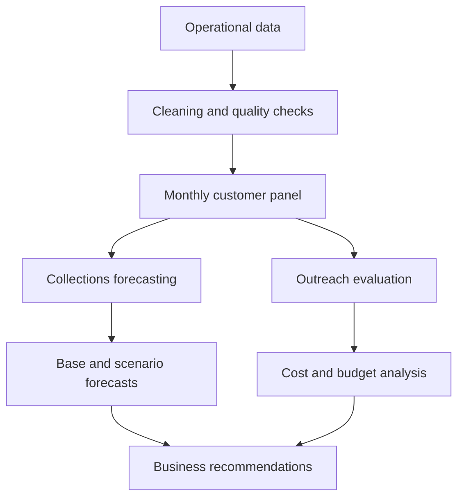

# Debt Collections Forecasting and Outreach Evaluation

<p align="center">
  A portfolio project for forecasting cash collections, evaluating customer outreach programmes and supporting budget decisions.
</p>

<p align="center">


</p>

## Overview

This project examines two related collections questions for a consumer-finance portfolio.

The first task is to forecast total country collections for the next three months. The forecast provides a base case, downside and upside scenarios. It also explains which business assumption has the greatest effect on the result.

The second task evaluates two customer-outreach programmes: preventative SMS reminders and outbound calls to customers in arrears. The analysis estimates whether each programme increased repayment, considers the cost of each contact method and recommends how to use a fixed monthly outreach budget.

The public repository focuses on the analytical process. It does not contain proprietary data, private customer information, or confidential business recommendations.

## Business Questions

### Collections forecast

* How much cash is likely to be collected over the next three months?
* What would a reasonable downside and upside look like?
* Which assumption creates the most forecast risk?
* How does the forecast compare with simpler methods?

### Outreach evaluation

* Did the SMS and call programmes increase repayment?
* Can the observed differences reasonably be linked to the programmes?
* Did the additional collections cover the outreach costs?
* Which programme should receive further investment?
* What test would provide stronger evidence?

## Project Outputs

| Output                           | Purpose                                                                |
| --------------------------------- | ---------------------------------------------------------------------- |
| Three-month collections forecast | Estimates monthly and quarterly cash collections                       |
| Scenario analysis                | Shows the effect of weaker or stronger business conditions             |
| Model comparison                 | Compares the main model with simple and statistical alternatives       |
| Backtest scorecard               | Measures historical forecast error and bias                            |
| Pilot evaluation                 | Estimates the repayment change associated with each outreach programme |
| Cost-effectiveness analysis      | Compares additional cash with the cost of outreach                     |
| Budget recommendation            | Allocates a fixed budget within observed programme capacity            |
| Data-quality audit               | Records corrections, exclusions and reconciliation differences         |

Private figures and decision outputs are intentionally excluded from this repository.

## Analytical Workflow



## Data

The original analysis used five related operational datasets.

| Dataset         | Information used                                                      |
| --------------- | --------------------------------------------------------------------- |
| Contracts       | Contract type, product, sale date, price, deposit and repayment terms |
| Payments        | Monthly cash received for each contract                               |
| Outreach        | Contact method, number of attempts, contact outcome and cost          |
| Calls           | Historical customer-call activity                                     |
| Service tickets | Product and service issues reported by customers                      |

The raw data is private and is not included in this repository.

The analysis uses a chronological split:

* **Estimation period:** Used to calculate repayment patterns and fit models.
* **Validation period:** Used to compare forecasts with known later outcomes.
* **Sealed period:** Kept hidden until the model, assumptions and forecast files were frozen.

This structure reflects how a real forecast works. Future observations are not randomly mixed into the training data.

## Data Preparation

The preparation process includes:

* Standardising dates, categories and numerical fields.
* Auditing exact duplicates before retaining one copy.
* Quarantining conflicting contract-month records.
* Flagging records with contract IDs that do not appear in the contract table.
* Checking whether events occur before the related contract starts.
* Correcting likely deposit-scale errors while retaining the original value and an audit flag.
* Separating scheduled collections from payments received after the scheduled loan term.
* Reconciling customer-level collections with the total cash reported at country level.
* Creating lagged variables using information available before the forecast month.

Raw files remain unchanged.

## Feature Engineering

The main analytical table contains one row per contract and month.

Important features include:

* Months since the contract started.
* Expected cash due during the month.
* Previous monthly payments.
* Recent payment totals and payment gaps.
* Months since the last payment.
* Contract type and repayment frequency.
* Product and region.
* Previous call attempts.
* Previous service-ticket activity.
* Whether the account remains inside its scheduled repayment period.

Same-month calls, service tickets and outreach activity are excluded from forecasting features where their timing relative to payment cannot be established. This prevents information from the outcome month leaking into the prediction.

## Forecasting Approach

The main forecast is a bottom-up cohort model. It estimates collections from the customer portfolio and then adds the expected contribution from planned new sales.

The forecast separates:

1. Collections from existing financed contracts.
2. Collections from new financed sales.
3. Collections from new cash sales.
4. Recovery after the scheduled loan term.
5. Adjustments required to reconcile the model with reported cash.

Repayment behaviour is estimated by contract age, contract type and region. Where a segment has limited observations, the model uses broader portfolio patterns to reduce unstable estimates.

### Models compared

| Model                   | Role                        |
| ----------------------- | --------------------------- |
| Cohort or vintage model | Main explainable forecast   |
| Ridge regression        | Machine-learning challenger |
| Damped Holt model       | Time-series comparison      |
| Recent-month average    | Simple benchmark            |

The final method is selected using historical performance, forecast bias, stability and ease of explanation. The most complex model does not automatically become the main forecast.

## Forecast Validation

The models are evaluated with rolling-origin backtests. Each test trains on earlier months and predicts a later period.

The main evaluation metrics are:

* **MAE:** Average forecast error in currency.
* **WAPE:** Total absolute error as a percentage of actual collections.
* **Bias:** Whether the forecast tends to run high or low.
* **Bias in currency:** The total amount over-forecast or under-forecast.

Performance is reviewed at country and regional level. Regional checks help identify places where a strong national result may hide local forecast problems.

The final three-month forecast is frozen before the sealed outcomes are opened. The sealed period is used as a final evaluation, rather than as another opportunity to adjust the model.

## Outreach Evaluation

The outreach programmes were not randomised, so a raw comparison between contacted and uncontacted customers would be misleading.

The analysis uses two complementary methods.

### Difference in differences

This method compares how repayment changed after a programme started relative to regions without the programme. Repayment expectations are adjusted for the age of each contract.

Pre-programme trends and fake-start placebo tests are checked before relying on the result.

### Customer matching

Propensity-score matching compares contacted customers with similar uncontacted customers in the same region and month.

The matching process includes:

* Logistic regression for the probability of receiving outreach.
* One-hot encoding for categorical variables.
* Standardisation of numerical variables.
* Nearest-neighbour matching.
* Common-support checks.
* Balance diagnostics.
* Sensitivity tests using different numbers of neighbours.
* Cluster bootstrap intervals at contract level.

Matching results are only used when enough treated and control customers overlap. A statistically precise result is not treated as representative when most customers fall outside the matched sample.

### Repayment measure

Repayment is measured as additional cash collected above the amount expected for a similar contract.

Every outreach attempt is counted, including unsuccessful attempts, because every attempt uses time or money.

Same-month cash is considered for preventative reminders. Next-month cash is also considered for arrears calls because customers may take longer to repay after a call.

## Cost and Budget Analysis

Programme value is assessed using:

* Cost per contact attempt.
* Additional cash per contacted customer.
* Additional cash collected per dollar spent.
* Net value after outreach cost.
* Monthly programme capacity.
* Strength and generalisability of the evidence.

The budget analysis can leave part of the available budget unallocated. Spending is only recommended where the evidence or expected learning value justifies the cost.

A proposed randomised rollout uses a control group to test whether results from one region transfer to other regions.

## Technology

| Category              | Tools                                   |
| --------------------- | ---------------------------------------- |
| Programming language  | Python                                  |
| Data analysis         | Pandas, NumPy                           |
| Machine learning      | scikit-learn                            |
| Time-series modelling | statsmodels                             |
| Visualisation         | Matplotlib                              |
| Notebooks             | Jupyter Notebook, Google Colab, IPython |
| Testing               | Python `unittest`                       |
| File handling         | pathlib, zipfile, JSON, hashlib         |
| Documentation         | Markdown, Mermaid, Shields.io           |
| Version control       | Git, GitHub                             |

The modelling uses statistical and classical machine-learning methods. No deep-learning framework is required.

## Repository Structure

```text
ForecastingDebtCollections/
│
├── data_cleaning/
│   └── data_cleaning_backbone.ipynb
│
├── feature_engineering/
│   └── feature_engineering_backbone.ipynb
│
├── model_building/
│   ├── forecast_version_0.ipynb            # naive benchmark
│   ├── forecast_version_1.ipynb
│   ├── forecast_version_2.ipynb            # shareable core model
│   ├── forecast_version_3.ipynb            # working notebook
│   ├── forecast_version_4.ipynb            # challenger models
│   ├── forecast_version_5_final.ipynb      # FINAL forecast
│   ├── evaluation_version_0.ipynb
│   └── evaluation_version_1_final.ipynb    # FINAL pilot evaluation
│
├── Tests/
│   ├── test_forecast_core.py
│   ├── test_pilot_core.py
│   └── test_feature_outputs.py
│
├── AI_WORKFLOW.md
├── requirements.txt
└── README.md
```

Each numbered version fixed a specific shortcoming in the one before it; the
highest version number in each folder is the one that shipped.

The notebooks reproduce the full pipeline end to end: cleaning, feature engineering, the naive benchmark, and the version history behind the final forecast and pilot evaluation. Running them against real figures requires the private source data, which is not included here.

## Installation

### Prerequisites

* Python 3.10 or later
* Git
* Jupyter Notebook, JupyterLab or Google Colab

### Clone the repository

```bash
git clone https://github.com/Kinjuriu/ForecastingDebtCollections.git
cd ForecastingDebtCollections
```

### Create a virtual environment

macOS or Linux:

```bash
python -m venv .venv
source .venv/bin/activate
```

Windows:

```bash
python -m venv .venv
.venv\Scripts\activate
```

### Install the libraries

```bash
pip install -r requirements.txt
```

If a requirements file is not yet available:

```bash
pip install pandas numpy matplotlib scikit-learn statsmodels jupyter
```

### Start Jupyter

```bash
jupyter lab
```

## Usage

### Google Colab

1. Open the required public notebook in Google Colab.
2. Upload an authorised local dataset when prompted.
3. Run the notebook from top to bottom.
4. Review the validation and quality checks.

### Local Jupyter environment

```bash
jupyter lab
```

Open the notebooks in numerical order.

The notebooks will not reproduce the confidential project figures without the authorised private input data. They can be adapted to another collections dataset with a similar structure.

## Tests

66 tests across three files, run with pytest from the `Tests/` folder:

```bash
pip install pytest pandas numpy scikit-learn statsmodels
cd Tests
FEATURES_DIR=/path/to/extracted/feature_outputs pytest -v
```

`FEATURES_DIR` should point at an unzipped feature-output folder; if it is not
set, the feature-output tests skip and the two core suites still run.

* **Forecast core** — hand-built fixtures with a calculator-checkable answer,
  plus the invariants that must always hold (components sum to the total,
  `low <= base <= high`, no leakage past the forecast origin).
* **Pilot-evaluation core** — synthetic worlds with a known injected effect,
  checking the method recovers it and reports no effect when there is none,
  plus budget-allocation and matching-hygiene rules.
* **Feature outputs** — schema and reconciliation checks against the frozen
  feature files, when `FEATURES_DIR` is available.

## Reproducibility

| Setting          | Value                            |
| ---------------- | --------------------------------- |
| Python           | 3.10 or later                    |
| Execution        | Jupyter or Google Colab          |
| Validation       | Rolling time-based backtesting   |
| Randomness       | Fixed random seed where required |
| Hardware         | CPU only                         |
| Package versions | Recorded in `requirements.txt`   |
| Data access      | Private data loaded locally      |

Forecast parameters, assumptions and output files should be frozen before the final holdout period is evaluated.

## Privacy and Responsible Use

This repository does not include:

* Raw or processed customer data.
* Customer or contract identifiers.
* Confidential company information.

Notebook outputs should be cleared before public commits. Any example data added later should be synthetic and should not reproduce real customer records.

## AI-Assisted Workflow

AI assistants supported parts of the coding, debugging, review and documentation process.

[`AI_WORKFLOW.md`](AI_WORKFLOW.md) explains how AI was used, how suggestions were checked and where human judgement remained necessary. It documents the process without publishing private prompts or conversations.

All analytical decisions, code changes and final interpretations were reviewed by the project owner.

## Limitations

* The notebooks require the private source data to reproduce real forecast and pilot figures.
* Forecasts depend on future sales and repayment behaviour remaining reasonably close to the stated assumptions.
* Historical backtests cannot remove uncertainty about future sales-plan delivery.
* The outreach programmes were observational rather than randomised.
* Matching adjusts for recorded differences but cannot remove unobserved selection.
* Service-ticket patterns can identify areas for investigation but cannot establish that a product issue caused lower repayment.
* Results from one region may not transfer directly to another region.

## Future Work

* Run a randomised outreach test within each region.
* Monitor repayment changes over calendar time at a fixed contract age.
* Recalibrate forecast ranges as new months become available.
* Test whether programme effects differ by arrears level and customer segment.
* Add synthetic example data for a fully public demonstration.
* Convert the notebook workflow into reusable Python modules.
* Add automated data-quality checks to continuous integration.

## Contributor

| Contributor    | Role                                                      |
| -------------- | ----------------------------------------------------------- |
| Stephane Njoki | Data preparation, modelling, evaluation and documentation |

This is currently an individual portfolio project.

## License

The code is available under the MIT License. See [`LICENSE`](LICENSE) for details.

The license does not grant access to or permission to use the private source data.
