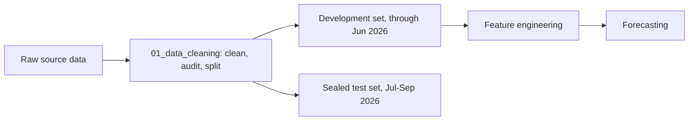

[](https://colab.research.google.com/github/Kinjuriu/ForecastingDebtCollections/blob/main/notebooks/01_data_cleaning.ipynb)


# Forecasting Debt Collections

Cleaning and analysing PayGo (pay-as-you-go) solar financing data, contracts,
payments, customer calls, service tickets, and collections outreach, to build a
short-term collections forecast and evaluate a regional customer outreach pilot.
Source data is never committed here; it stays local and is only read by the
notebooks (see Data below).

## How it works



The cleaning notebook does not do feature engineering or modelling. It splits
the data into a development period and a held-out test period so a forecast
can be evaluated without peeking at the answer.

## Project structure

```
.
├── notebooks/
│   ├── 01_data_cleaning.ipynb   # run this in Colab
│   └── 01_data_cleaning.py      # jupytext mirror, kept in sync automatically
├── data_dictionary.txt          # column definitions for the five source files
├── AI_WORKFLOW.md               # how this repo's code is written/edited with AI
├── tools/strip_notebook_outputs.py
├── requirements-dev.txt         # jupytext + nbdime, for working on this repo
└── .gitattributes                # tells git to diff notebooks with nbdime
```

## Notebook versioning

Notebooks are paired with [Jupytext](https://jupytext.readthedocs.io): every
`.ipynb` has a `.py` twin kept in sync, and the `.py` file is what gives clean,
readable diffs (a raw notebook diff is mostly unreadable JSON). git is also
configured to diff `.ipynb` files with [nbdime](https://nbdime.readthedocs.io)
directly (see `.gitattributes`), and GitHub renders notebook diffs natively on
this page. Commit history on `notebooks/01_data_cleaning.ipynb` reflects real
revisions, not a single drop-in file.

To work on a notebook locally: `pip install -r requirements-dev.txt`, edit
either the `.ipynb` or the `.py`, then run `jupytext --sync notebooks/01_data_cleaning.ipynb`
to bring the other back in sync before committing.

## Status

- [x] Data cleaning: done, versioned
- [ ] Feature engineering: not started
- [ ] Forecasting: not started
- [ ] Convert notebooks to `.py` modules: not started

## Getting started

```bash
git clone https://github.com/Kinjuriu/ForecastingDebtCollections.git
cd ForecastingDebtCollections
pip install -r requirements-dev.txt
```

Open `notebooks/01_data_cleaning.ipynb` in Colab (badge above) or locally, and
upload the five source CSVs when prompted (they're not included in this repo).

## Data

Raw source files and any generated outputs are intentionally excluded from
version control; see `.gitignore`. Only cleaned code and documentation are
tracked.
