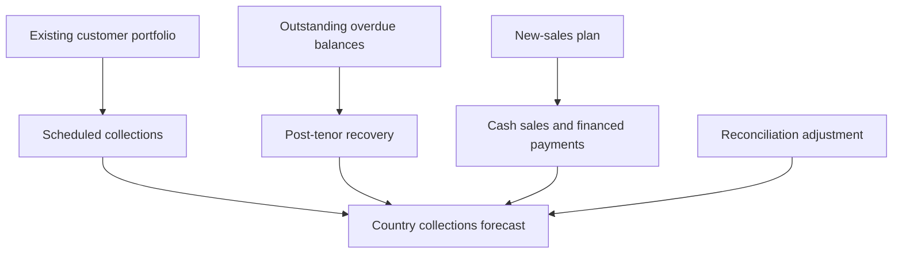

# Debt Collections Forecasting and Outreach Evaluation

<p align="center">
  A decision analytics project combining cash forecasting, outreach evaluation and budget allocation.
</p>

<p align="center">


</p>

---

## Overview

This project addresses two business questions for a consumer-finance portfolio:

1. How much cash could be collected over the next three months?
2. Which of two regional customer-outreach programmes should receive further investment?

The first analysis builds a country-level collections forecast from the existing customer portfolio and planned new sales. The second evaluates a preventative SMS programme and an outbound call programme using observational causal methods.

The raw customer data is private and is not included in this repository. The notebooks, tests, methodology and version history are included.

---

## Key Results

| Business question                                | Finding                                                                                                                                      | Recommended action                                       |
| ------------------------------------------------ | -------------------------------------------------------------------------------------------------------------------------------------------- | -------------------------------------------------------- |
| How much cash could be collected in Q3 2026?     | Base forecast of **$1.42 million**, with a scenario range of **$1.20 million to $1.48 million**                                              | Use the base case for planning and monitor sales monthly |
| What creates the greatest forecast risk?         | Sales-plan attainment. Remaining at the June sales rate would reduce Q3 collections by approximately **$136,000**                            | Refresh the forecast when monthly sales become available |
| Should preventative SMS be scaled?               | Scheduled collections increased by approximately **11%** at a cost of about **$0.08 per customer**                                           | Scale cautiously and test the programme in other regions |
| Should outbound calls be scaled?                 | Calls improved repayment, but produced roughly **$0.50 per contact** against a cost of about **$2.22**                                       | Do not scale the programme in its current form           |
| Were the product concerns supported by the data? | One product-region segment repaid about **25% below its expected curve** and had **four to five times more battery and charging complaints** | Investigate product quality and after-sales support      |

---

## Collections Forecast

### Q3 2026 forecast

| Month          |       Downside |      Base case |         Upside |
| -------------- | -------------: | -------------: | -------------: |
| July 2026      |       $399,143 |   **$463,091** |       $481,978 |
| August 2026    |       $404,414 |   **$476,019** |       $498,841 |
| September 2026 |       $400,937 |   **$478,055** |       $504,074 |
| **Q3 total**   | **$1,204,493** | **$1,417,165** | **$1,484,893** |

The downside and upside are business scenarios. They are not formal statistical confidence intervals.

### Forecast composition

| Source of collections                                     |                Q3 forecast |     Share |
| --------------------------------------------------------- | -------------------------: | --------: |
| Existing customers within their scheduled payment period  |                   $721,069 |     50.9% |
| Recovery of overdue balances after scheduled contract end |                    $87,938 |      6.2% |
| **All existing customers**                                | **approximately $809,007** | **57.1%** |
| New financed sales                                        |                   $307,561 |     21.7% |
| New cash sales                                            |                   $284,086 |     20.0% |
| **All new sales**                                         | **approximately $591,647** | **41.7%** |
| Country-level reconciliation adjustment                   |      approximately $16,509 |      1.2% |

Displayed components are rounded, so they may differ from the headline total by a few dollars.

### Main forecast sensitivities

| Assumption                  | Scenario                                          | Change from base |
| --------------------------- | ------------------------------------------------- | ---------------: |
| Sales-plan attainment       | Sales remain at approximately 77% of plan         |    **−$136,079** |
| Regional programmes stop    | East and West return to earlier collection levels |         −$35,298 |
| Existing-book collections   | Repayment is weaker than recent experience        |         −$26,592 |
| Post-tenor arrears recovery | Recovery is 25% lower                             |         −$21,457 |
| Cash share of new sales     | Fewer new customers pay the full price upfront    |          −$9,183 |

Sales-plan attainment is the largest sensitivity because new sales produce immediate cash through cash purchases, deposits and early financed repayments.

---

## Forecasting Method

The main forecast is a bottom-up cohort model. It follows the different ways cash enters the business.



Customers are grouped using information such as:

* Region
* Product
* Contract type
* Payment frequency
* Contract age
* Scheduled contract duration

Historical repayment patterns are applied to the portfolio that existed at the forecast date. Planned new sales are modelled separately.

---

## Model Performance

The models were tested using rolling forecast origins. At each origin, the model used only earlier information and predicted a later quarter whose actual collections were already known.

Lower WAPE is better.

| Model                                             | Jun 2025 | Sep 2025 | Dec 2025 | Mar 2026 | Mean WAPE | Mean bias |
| ------------------------------------------------- | -------: | -------: | -------: | -------: | --------: | --------: |
| `cohort_A_curve_through_origin`                   |     1.6% |     3.2% |     5.3% |     2.6% |  **3.2%** |     −0.7% |
| `ridge_challenger_existing_plus_cohort_new_sales` |     1.4% |     3.3% |     6.9% |     1.3% |  **3.2%** |     −0.5% |
| `cohort_B_curve_cut_3m_before_origin`             |     3.1% |     2.7% |     5.2% |     2.2% |      3.3% |      0.9% |
| `cohort_B_without_level_factor`                   |     3.8% |     2.5% |     5.4% |     2.4% |      3.5% |      1.9% |
| `naive_last_3m_average`                           |    12.4% |    11.5% |     8.4% |     5.6% |      9.5% |     −6.0% |
| `holt_damped`                                     |     6.3% |     9.7% |    12.1% |    15.6% |     10.9% |      2.9% |

### Model roles

| Model                             | Role                           | Decision                                  |
| --------------------------------- | ------------------------------ | ----------------------------------------- |
| Cohort model                      | Explainable bottom-up forecast | Selected as the main model                |
| Ridge regression                  | Machine-learning challenger    | Retained as an independent check          |
| Damped Holt                       | Time-series challenger         | Retained as a comparison                  |
| Recent three-month average        | Simple benchmark               | Used as the minimum performance threshold |
| Alternative cohort specifications | Robustness checks              | Used to test curve and level assumptions  |

The cohort and Ridge models had the same average WAPE. The cohort model remained the headline model because it was stable, easy to explain and directly connected to the customer portfolio.

### Frozen Q3 forecasts

| Model                                             |     July |   August | September |       Q3 total |
| ------------------------------------------------- | -------: | -------: | --------: | -------------: |
| `cohort_A_curve_through_origin`                   | $463,091 | $476,019 |  $478,055 | **$1,417,165** |
| `ridge_challenger_existing_plus_cohort_new_sales` | $466,781 | $477,183 |  $480,225 |     $1,424,189 |
| `naive_last_3m_average`                           | $440,584 | $440,584 |  $440,584 |     $1,321,752 |
| `holt_damped`                                     | $409,787 | $412,955 |  $415,889 |     $1,238,631 |

July to September payment outcomes were held out by the data provider. The forecasts were frozen without access to those outcomes.

---

## Outreach Evaluation

The regional programmes were not randomly assigned. Two complementary approaches were used.

### Difference-in-Differences

Difference-in-Differences compares the change in repayment in a programme region with the change over the same period in regions without that programme.

The analysis adjusts for contract age and checks whether the regions followed similar trends before the programme began.

### Customer Matching

Matching compares contacted customers with similar uncontacted customers in the same region and month.

Logistic regression estimates each customer’s probability of receiving outreach. Nearest-neighbour matching then finds customers with similar probabilities and prior characteristics.

Matching is used only when the treated and comparison groups have enough overlap.

---

## Programme Evidence and Actions

| Programme        | Credible method                                               |                                                                                           Estimated effect | Cost and value                                                           | Action                                                                   |
| ---------------- | ------------------------------------------------------------- | ---------------------------------------------------------------------------------------------------------: | ------------------------------------------------------------------------ | ------------------------------------------------------------------------ |
| Preventative SMS | Age-adjusted Difference-in-Differences                        |                                                           Approximately **11% increase in scheduled cash** | About $0.08 per customer and approximately $6.70 gross cash per $1 spent | **Scale cautiously** and test transfer to other regions                  |
| Outbound calls   | Difference-in-Differences supported by within-region matching | Approximately **7% repayment improvement**; matching indicates about **$0.50 additional cash per contact** | Approximately $2.22 per contact, producing a negative net return         | **Do not scale as currently operated**; test a smaller targeted approach |

Matching was not used as the main estimate for the SMS programme because almost the entire region received messages. The small untreated group was not representative enough to support a reliable matched comparison.

The SMS result is more economically attractive. Causal confidence remains moderate because the original programmes were observational.

---

## Recommended Monthly Budget

| Use                                       | Allocation | Expected additional cash |           Expected net value |
| ----------------------------------------- | ---------: | -----------------------: | ---------------------------: |
| Continue the established SMS programme    |     $1,152 |                   $7,661 |                       $6,509 |
| Test SMS in three additional regions      |     $2,808 |                   $9,339 |                       $6,531 |
| Run a targeted outbound-call experiment   |     $2,000 |                   $1,407 |                        −$593 |
| Hold for reallocation after early results |     $2,040 |                        — |                            — |
| **Total budget**                          | **$8,000** |              **$18,407** | **$12,447 on planned spend** |

The reserve allows the remaining budget to be directed using early test results. Expected value is a planning estimate rather than a guaranteed return.

---

## Data

The analysis uses five linked operational datasets.

| Dataset              | Information used                                       |
| -------------------- | ------------------------------------------------------ |
| Contracts            | Product, sale date, price, deposit and repayment terms |
| Payments             | Monthly cash received for each contract                |
| Collections outreach | Channel, attempts, reach and cost                      |
| Customer calls       | Historical customer-call activity                      |
| Service tickets      | Product and service issues                             |

### Time split

| Period        | Purpose                                     |
| ------------- | ------------------------------------------- |
| Estimation    | Learn repayment patterns and fit models     |
| Validation    | Compare forecasts with known later outcomes |
| Final holdout | Evaluate the frozen forecast                |

The final holdout payment outcomes were not included in the supplied files.

### Data preparation

The cleaning pipeline:

* Standardises identifiers, dates, categories and numeric fields.
* Preserves original values before applying corrections.
* Removes extra copies of exact duplicate payments.
* Quarantines conflicting contract-month records.
* Flags records occurring before the related contract starts.
* Audits likely deposit-scale errors.
* Separates scheduled repayments from overdue balances collected after tenor.
* Reconciles contract-level cash with country totals.
* Prevents future outcomes from entering model development.

The original data is not included in this repository.

---

## Versioning and Model Progression

The repository keeps earlier modelling notebooks because each version answers a specific question or fixes a specific weakness.

These versions are code iterations. They are not separately deployed model binaries.

### Forecast versions

| File                       | Purpose                            | What changed                                                                                                             |
| -------------------------- | ---------------------------------- | ------------------------------------------------------------------------------------------------------------------------ |
| `forecast_version_0`       | Naive benchmark                    | Establishes the recent three-month average that later models must beat                                                   |
| `forecast_version_1`       | First complete forecasting attempt | Introduces the chronological holdout, cohort model, scenarios and backtesting                                            |
| `forecast_version_2`       | Shareable cohort core              | Separates the main forecast arithmetic into reusable functions                                                           |
| `forecast_version_3`       | Working diagnostic version         | Adds regional checks, reconciliation and external-model comparison                                                       |
| `forecast_version_4`       | Challenger comparison              | Adds Ridge regression and damped Holt alongside the cohort model                                                         |
| `forecast_version_5_final` | Final forecast                     | Uses real calendar days, segment shrinkage, current-level factors, anomaly controls and stricter out-of-sample backtests |

### Evaluation versions

| File                         | Purpose                  | What changed                                                                                                                                                             |
| ---------------------------- | ------------------------ | ------------------------------------------------------------------------------------------------------------------------------------------------------------------------ |
| `evaluation_version_0`       | Initial pilot evaluation | Uses matching and initial cost-effectiveness calculations                                                                                                                |
| `evaluation_version_1_final` | Final pilot evaluation   | Adds age-adjusted Difference-in-Differences, rejects the weak East matched comparison, adds cluster bootstrap intervals and links each pilot to the most credible method |

### Backbone files

| File                           | Role                                                              |
| ------------------------------ | ----------------------------------------------------------------- |
| `data_cleaning_backbone`       | Final deterministic cleaning and chronological split              |
| `feature_engineering_backbone` | Final contract-month panel, cohort backbone and reconciliation    |
| `forecast_core.py`             | Shared forecast calculations used by the model-building notebooks |
| `DECISION_LOG.md`              | Explains why each version exists and what changed                 |

### Notebook and Python pairs

Most notebooks have a matching `.py` file:

```text
forecast_version_5_final.ipynb
forecast_version_5_final.py
```

The `.ipynb` file is intended for execution and presentation. The `.py` mirror makes changes easier to review with Git.

The files can be synchronised with Jupytext:

```bash
jupytext --sync model_building/forecast_version_5_final.ipynb
```

Notebook outputs are removed before committing:

```bash
python tools/strip_notebook_outputs.py \
  model_building/forecast_version_5_final.ipynb
```

Earlier repository versions used a folder called `models/`. The current repository uses `model_building/`. Git records the file history across this move, while the current folder gives readers one clear location for the modelling sequence.

The shipped versions are:

* `data_cleaning_backbone.ipynb`
* `feature_engineering_backbone.ipynb`
* `forecast_version_5_final.ipynb`
* `evaluation_version_1_final.ipynb`

Earlier versions remain available as an audit trail.

See [`DECISION_LOG.md`](DECISION_LOG.md) for the full reasoning behind the progression.

---

## Repository Structure

```text
ForecastingDebtCollections/
│
├── .claude/
│   └── README.md
│
├── data_cleaning/
│   ├── data_cleaning_backbone.ipynb
│   └── data_cleaning_backbone.py
│
├── feature_engineering/
│   ├── feature_engineering_backbone.ipynb
│   └── feature_engineering_backbone.py
│
├── model_building/
│   ├── forecast_core.py
│   ├── forecast_version_0.ipynb
│   ├── forecast_version_0.py
│   ├── forecast_version_1.ipynb
│   ├── forecast_version_1.py
│   ├── forecast_version_2.ipynb
│   ├── forecast_version_2.py
│   ├── forecast_version_3.ipynb
│   ├── forecast_version_3.py
│   ├── forecast_version_4.ipynb
│   ├── forecast_version_4.py
│   ├── forecast_version_5_final.ipynb
│   ├── forecast_version_5_final.py
│   ├── evaluation_version_0.ipynb
│   ├── evaluation_version_0.py
│   ├── evaluation_version_1_final.ipynb
│   └── evaluation_version_1_final.py
│
├── Tests/
│   ├── README.md
│   ├── conftest.py
│   ├── p1_core.py
│   ├── p2_core.py
│   ├── test_feature_outputs.py
│   ├── test_forecast_core.py
│   └── test_pilot_core.py
│
├── tools/
│   └── strip_notebook_outputs.py
│
├── .gitattributes
├── .gitignore
├── AI_WORKFLOW.md
├── DECISION_LOG.md
├── data_dictionary.txt
├── requirements.txt
├── requirements-dev.txt
├── LICENSE
└── README.md
```

---

## Tests

The repository contains 66 tests across three areas.

| Test group      | What it checks                                                                                    |
| --------------- | ------------------------------------------------------------------------------------------------- |
| Forecast core   | Calendar-day billing, component totals, scenarios, regional reconciliation and leakage protection |
| Pilot core      | Known-effect recovery, no-effect behaviour, placebos, matching hygiene and budget rules           |
| Feature outputs | Schema, chronological boundary, reconciliation and frozen feature controls                        |

Run the tests from the repository root:

```bash
pip install -r requirements.txt
FEATURES_DIR=/path/to/extracted/feature_outputs pytest -v Tests
```

If `FEATURES_DIR` is not supplied, the feature-output tests are skipped and the two core suites still run.

See [`Tests/README.md`](Tests/README.md) for details.

---

## Technology

| Category                              | Tools                                      |
| ------------------------------------- | ------------------------------------------ |
| Language                              | Python                                     |
| Data analysis                         | Pandas, NumPy                              |
| Machine learning                      | scikit-learn                               |
| Statistical and time-series modelling | statsmodels                                |
| Visualisation                         | Matplotlib                                 |
| Notebooks                             | Jupyter Notebook, Google Colab and IPython |
| Testing                               | pytest                                     |
| Notebook versioning                   | Jupytext, nbdime and Git                   |
| Documentation                         | Markdown, Mermaid and Shields.io           |
| File handling                         | pathlib, zipfile, JSON and hashlib         |

The project uses statistical and classical machine-learning methods. Deep learning is not required for this analysis.

---

## Installation

### Clone the repository

```bash
git clone https://github.com/Kinjuriu/ForecastingDebtCollections.git
cd ForecastingDebtCollections
```

### Create an environment

macOS or Linux:

```bash
python -m venv .venv
source .venv/bin/activate
```

Windows:

```bash
python -m venv .venv
.venv\Scripts\activate
```

### Install runtime dependencies

```bash
pip install -r requirements.txt
```

### Install notebook-versioning tools

```bash
pip install -r requirements-dev.txt
```

### Start Jupyter

```bash
jupyter lab
```

---

## Running the Project

Run the final pipeline in this order:

1. `data_cleaning/data_cleaning_backbone.ipynb`
2. `feature_engineering/feature_engineering_backbone.ipynb`
3. `model_building/forecast_version_5_final.ipynb`
4. `model_building/evaluation_version_1_final.ipynb`
5. `pytest -v Tests`

Earlier forecast and evaluation versions are retained to show how the methods developed. They do not all need to be executed to reproduce the final workflow.

The private source files are required to reproduce the original figures. The code can be adapted to another collections dataset with a similar structure.

---

## Reproducibility

| Setting           | Value                          |
| ----------------- | ------------------------------ |
| Python            | 3.10 or later                  |
| Execution         | Jupyter or Google Colab        |
| Validation        | Rolling time-based backtesting |
| Randomness        | Fixed seed where required      |
| Hardware          | CPU only                       |
| Runtime packages  | `requirements.txt`             |
| Development tools | `requirements-dev.txt`         |
| Data access       | Private files loaded locally   |

Forecast assumptions and output files were frozen before the final holdout period could be evaluated.

[`AI_WORKFLOW.md`](AI_WORKFLOW.md) documents how AI-assisted suggestions were scoped, reviewed and validated.

---

## Privacy and Responsible Use

This repository does not include:

* Raw or processed customer data
* Customer or contract identifiers
* Confidential company information
* Authentication credentials
* Confidential presentations or source files

Notebook outputs are removed before public commits. Any demonstration data added later should be synthetic.

---

## Limitations

* The final holdout payment outcomes were not included in the supplied data.
* Forecast performance depends heavily on delivery of the sales plan.
* Scenario ranges are business sensitivities rather than formal prediction intervals.
* The regional programmes were observational.
* Difference-in-Differences cannot remove shocks affecting only one programme region.
* Matching adjusts for recorded differences but cannot remove unobserved selection.
* The SMS result has not been tested outside its original region.
* Product and service-ticket patterns support investigation but do not prove causation.
* The private source data limits full public reproduction.

---

## Future Work

* Run a randomised outreach test within each region.
* Test SMS transferability outside the original programme region.
* Improve outbound-call targeting.
* Refresh the forecast as new monthly data becomes available.
* Add synthetic data for a fully public demonstration.
* Add continuous integration for the test suite.
* Automate notebook output stripping before commits.

---

## Contributor

<table>
  <tr>
    <td align="center">
      <a href="https://github.com/Kinjuriu">
        <br>
        <sub><b>Stephane Njoki</b></sub>
      </a>
      <br>
      Data preparation, forecasting, causal evaluation, testing and documentation
    </td>
  </tr>
</table>

This is currently an individual portfolio project.

---

## License

This project is licensed under the [MIT License](LICENSE).

The licence applies to the repository’s code and documentation. It does not grant access to the private source data.
